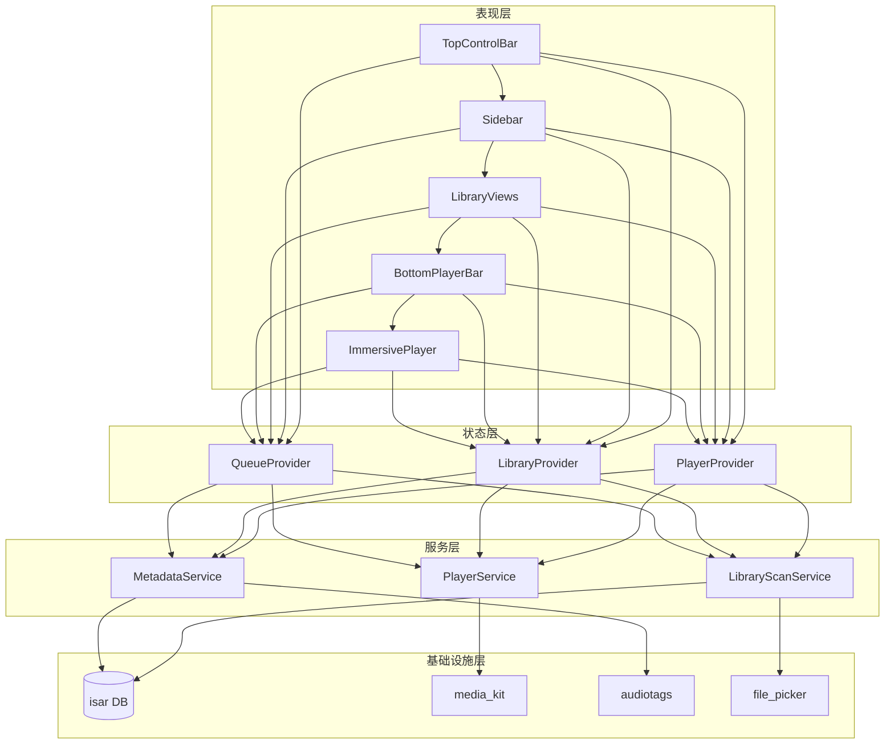

# 产品需求文档 (PRD) - MY Music Player

| 文档信息     | 内容                            |
| :------- | :---------------------------- |
| **项目名称** | MY Music Player (MYMP)        |
| **版本号**  | V1.0.2                        |
| **文档状态** | Draft (草稿)                    |
| **最后更新** | 2026-02-02                    |
| **平台**   | Windows (Desktop)             |
| **技术栈**  | Flutter (UI), Dart (Language) |

---

## 1. 产品概述 (Product Overview)

### 1.1 背景与定位
本项目旨在开发一款基于 Windows 平台的本地音乐播放与管理软件。区别于市面上传统的本地播放器，MYMP 利用 Flutter 的高性能渲染引擎，提供极其现代化的视觉体验。

### 1.2 核心价值主张 (Core Value)
1.  **极致视觉**：融合 roon的简约与《绝区零》(ZZZ) 的潮流硬核风格，提供沉浸式视听体验。
2.  **高效管理**：解决本地大量无序音乐文件的整理痛点，提供批量化、多维度的管理能力。
3.  **专业回放**：透明的音频参数展示、技术链路展示与灵活的播放控制。

---

## 2. 用户角色 (User Roles)

| 角色          | 描述                    | 典型行为                   |
| :---------- | :-------------------- | :--------------------- |
| **本地音乐收藏家** | 拥有大量本地音频文件 (FLAC/MP3) | 管理元数据，整理专辑，按文件夹归档。     |
| **视觉体验党**   | 对软件 UI/动效有极高要求        | 挂机听歌时欣赏频谱与动态歌词，切换不同主题。 |
| **普通用户**    | 仅仅需要播放音乐              | 随机播放，简单的列表操作。          |

---

## 3. 功能需求 (Functional Requirements)

优先级定义：`P0`,`P0.5`,`P1`, `P2`

### 3.1 音乐库管理模块 (Library Management)

| ID         | 功能名称        | 需求描述                                                                                                                                                                                                    | 优先级 |
| :--------- | :---------- | :------------------------------------------------------------------------------------------------------------------------------------------------------------------------------------------------------ | :-- |
| **LIB-01** | **本地源管理**   | 1. 支持添加/删除多个本地文件夹路径。 2. 递归扫描文件夹内的音频文件。 3. **扫描策略**：初次添加为全量扫描；后续启动或手动触发时执行**增量扫描**（仅处理文件修改时间变化或新增的文件），以优化性能。 4. 扫描过程必须在 **Dart Isolate (独立线程)** 中运行，避免阻塞 UI 主线程，并提供扫描进度反馈（如：‘正在扫描 102/5000...’） | P0  |
| **LIB-02** | **多维视图**    | **专辑视图**：网格显示封面，按专辑聚合。可展开各专辑。 **作者视图**：列表显示，按 Artist 聚合。 **文件夹视图**：保留物理目录树结构。 **歌单视图**：显示用户自建歌单。                                                                                               | P0  |
| **LIB-03** | **自建歌单**    | 支持创建新歌单；支持从其他视图右键/拖拽歌曲加入歌单。                                                                                                                                                                             | P0  |
| **LIB-04** | **全局搜索**    | 支持关键词模糊匹配（Title, Album, Artist），结果高亮展示。也包括各视图内搜索                                                                                                                                                        | P0  |
| **LIB-05** | **元数据编辑**   | 1. 支持选中单曲或多曲。 2. 修改 Tags：封面、标题、歌手、专辑、年份。 3. 修改操作需直接写入源文件。                                                                                                                                         | P0  |
| **LIB-06** | **播放列表持久化** | 1. 内部数据库存储歌单。 2. 支持导入/导出 `.m3u` 文件。 3. 相对路径处理：导出时使用相对路径，确保移动文件后可用。                                                                                                                                | P0  |
### 3.2 播放控制模块 (Player Core)

| ID         | 功能名称     | 需求描述                                                                                                                                  | 优先级  |
| :--------- | :------- | :------------------------------------------------------------------------------------------------------------------------------------ | :--- |
| **PLY-01** | **格式解码** | 原生支持 MP3, WAV, FLAC 格式播放。使用 `media_kit` 库实现。                                                                                            | P0.5 |
| **PLY-02** | **参数监视** | 在播放栏显示当前文件的： 1. 码率 (Bitrate, e.g., 320kbps/1411kbps) 2. 采样率/位深 (可选)                                                             | P1   |
| **PLY-03** | **播放队列** | 1. **实时列表**：显示当前待播放曲目。 2. **即时操作**：支持拖拽排序、多选删除、右键"下一首播放"。                                                                          | P0.5 |
| **PLY-04** | **循环模式** | 支持三种模式切换： 1. 随机播放 (Shuffle) 2. 单曲循环 (Loop One) 3. 列表循环 (Loop List)                                                           | P0.5 |
| **PLY-05** | **定时停止** | 1. 设定倒计时 (15/30/60min或输入时间)。 2. **智能截断**：可勾选“播放完当前歌曲后停止”，避免在歌曲中间切断。                                                                | P2   |
| **PLY-06** | 信号路径     | \[TBD]仿roon功能，可以显示媒体源-解码-音频传输-播放器流程。 模式切换 (Exclusive Mode Switching)：当切换输出设备或开启/关闭 WASAPI 独占模式时，若需重启播放引擎，需提供平滑的重初始化体验（或自动暂停并提示用户）。 | P2   |
| **PLY-07** | **播放控制** | 1、歌曲的播放/暂停，上一曲，下一曲。 2、歌曲进度控制条，可以拖动音频播放进度 3、集成 Windows **SMTC (System Media Transport Controls)**，支持键盘物理多媒体按键控制                  | P0.5 |

### 3.3 音乐视觉模块 (Visual System)

此模块需利用 Flutter 的 Shader (着色器) 能力实现高性能动效。

#### 3.3.1 主题系统
本版本仅开发**Intense (ZZZ风格)** 的单一风格实现，并融合roon的简约界面设计。
未来计划系统需包含两套或以上完全不同的渲染逻辑，用户可一键切换。

| 主题名称                       | 风格定义          | 视觉特征                                                |
| :------------------------- | :------------ | :-------------------------------------------------- |
| 激烈 (Intense)               | 仿 ZZZ (绝区零)   | **关键字**：高对比度。 背景偏暗，强调锐利的几何图形与节拍同步的闪烁。            |

#### 3.3.2 歌词与可视化

| ID         | 功能名称      | 需求描述                                                                                                                                                                                                                          | 优先级 |
| :--------- | :-------- | :---------------------------------------------------------------------------------------------------------------------------------------------------------------------------------------------------------------------------- | :-- |
| **VIS-01** | **歌词渲染**  | 1.支持 `.lrc` 解析与时间轴同步。 2.ZZZ样式：打字机式歌词，胶片质感背景，当前句高亮。                                                                                                                                                                         | P1  |
| **VIS-02** | **歌词设置**  | 支持自定义字体（读取系统字体库）、字号大小调整。                                                                                                                                                                                                      | P1  |
| **VIS-03** | **翻译对照**  | 识别歌词中的翻译文本（或双语lrc），支持主副歌词对照显示。                                                                                                                                                                                                | P2  |
| **VIS-04** | **音频可视化** | 1.**zzz风格波浪频谱**：线性/曲线波形图（spectrum）。~~将频谱波形经过平滑插值，画出四条线（红、绿、蓝、黑色），四条线经过缩放/相位变换以形成偏差，最终颜色叠加在一起形成多种颜色。~~基于 FFT 数据生成高对比度波形，结合色差效果 (Chromatic Aberration)。不依赖 `media_kit` 的 `audioParams`，需通过采集原始 PCM 数据并使用 `fftea` 等数学库进行 FFT 变换。 | P1  |
| VIS-06     | 静态全曲波形进度条 | 是一种音频播放进度条可视化方案。通过可视化音频振幅数据，展现歌曲完整的能量起伏趋势，辅助用户进行直观的进度跳转。**实现逻辑**：歌曲首次扫描或播放时，在后台线程完成全曲振幅采样分析并进行持久化缓存。再次播放时直接从缓存读取绘制，避免重复计算。                                                                                                    | P2  |
| VIS-07     | 歌词读取顺序    | 定义查找逻辑优先级： 1. **内嵌歌词** (Embedded Lyrics, ID3 tag) -> 优先级最高。 2. **本地同名文件** (同文件夹下的 `filename.lrc`)。   3. \[TBD]在线匹配（暂不实现）。                                                                                            | P1  |
|            |           |                                                                                                                                                                                                                               |     |

## 4. UI/UX 互动逻辑 (UI/UX Interaction Logic)

### 4.1 设计原则与范围 (Principles & Scope)
本章节定义了 MYMP 界面五大核心区块的交互行为与逻辑流转。
* **注意**：本版本 (V1.0) 侧重于框架搭建、导航流转与基础播放控制。
* **视觉预留**：沉浸式页面的具体 Shader 渲染效果与主题差异化（Mode A/B）将在开发后期通过独立的《视觉设计规范》进行定义，本初版文档仅定义其**入口**、**布局**与**交互框架**。

---

### 4.2 顶部控制栏 (Top Control Bar)
*定位：全局操作锚点，负责窗口管理与视图历史导航。*
优先级：P0

| 组件/功能     | 交互逻辑描述                                            | 视觉/动效反馈                               |
| :-------- | :------------------------------------------------ | :------------------------------------ |
| **导航历史**  | **后退/前进**：记录用户在“主体信息栏”的浏览路径（如：专辑列表 > 专辑详情 > 歌手页）。 | 点击时，主体内容区执行平滑横向切换动画。若无历史，按钮置灰。        |
| **侧边栏开关** | 点击切换左侧边栏的显示/隐藏状态。                                 | **折叠动效**：侧边栏向左平滑收起，主体信息栏自动向左扩张填满剩余空间。 |
| **全局搜索**  | 点击激活搜索框，支持输入关键词实时检索本地库。                           | **Overlay 覆盖**：搜索结果页以下拉面板形式覆盖在当前内容之上。 |
| **窗口控制**  | 最小化、最大化/还原、关闭。                                    | 遵循 Windows 原生窗口交互规范 (支持 Snap Layout)。 |
| 拖拽移动窗口    | 顶部控制栏空白区域需设定为 `DraggableRegion`，允许用户拖拽移动窗口。       |                                       |

---

### 4.3 左侧边栏 (Left Sidebar)
*定位：一级导航入口，采用双层级树状结构。*
优先级：P0
#### 4.3.1 导航交互
* **状态变化**：
    * **默认态与选中态 (Active)相区分**：文字高亮，左侧显示指示条，明确当前模块。
* **模块逻辑**：
    1.  **音乐库 (Library)**：
        * 点击子项（专辑/作者/歌单/文件夹），中间主体栏立即刷新为对应视图。
    2.  **设置 (Settings)**：
        * 点击子项（存储/关于/语言与字体），主体栏切换至设置详情页（非弹窗模式，保持沉浸感）。存储页面可以管理读取的文件夹。关于页面可以显示本软件的一些信息（后续补充）。语言与字体页面可以设置显示语言（英文/简体中文），各界面和窗口字体独立调整，中英文字体独立调整。

---

### 4.4 中间主体信息栏 (Main Content Area)
*定位：核心视窗，承载列表、网格与详情页。*
优先级：P0
#### 4.4.1 视图逻辑
* **自适应布局**：在“专辑视图”下，网格列数需随窗口宽度动态调整（Responsive Grid），保证封面展示比例协调。
* **滚动体验**：采用惯性滚动机制。

#### 4.4.2 内容操作
* **跳转详情**：点击专辑封面，通过 **Hero 动画**（元素共享转场）进入专辑详情页。
* **右键菜单**：在任意歌曲/专辑条目上点击右键，弹出上下文菜单（包含：播放、下一首、添加到歌单、编辑元数据）。

---

### 4.5 下侧边栏 (Bottom Player Bar)
*定位：常驻式播放控制与状态监视。*
优先级：**布局框架 P0** / **播放功能 P0.5**
#### A. 左侧：信息区 (Info Area)
* **封面交互**：显示当前播放曲目的缩略图。**点击封面将触发“沉浸式播放栏”的展开（详见 4.6）。**
* **文本展示**：显示歌名、歌手。若文本过长，鼠标悬停时触发滚动显示或者缩小字号。

#### B. 中部：控制区 (Control Area)
* **基础控制**：上一首、播放/暂停 (Space 键映射)、下一首。
* **进度条 (Scrubbing)**：
    * 支持拖拽调整进度。
    * **悬浮预览**：鼠标在进度条悬停时，上方浮动显示对应时间点 (Tooltip)。

#### C. 右侧：工具区 (Tools Area)
* **播放列表**：点击后从右侧滑出“待播清单”侧板。
* **音量控制**：支持拖拽滑块或鼠标滚轮直接调节。
* **信号路径 (Signal Path)**：_(参考 Roon 核心功能)_
	* **逻辑**：显示一个小光点图标，颜色代表音质（紫色=无损，绿色=高质，黄色=有损）。
    - **交互**：点击图标弹出一个**透明气泡 (Tooltip)**，展示音频处理链（例如：`Source: FLAC 44.1kHz` -> `DSP: None` -> `Output: WASAPI Exclusive`），让专业用户确认“Bit-perfect”状态。

---

### 4.6 沉浸式播放栏 (Immersive Playback Interface) 
*定位：全屏听歌模式。本节仅定义布局框架，具体 Shader 视觉效果待定 (TBD)。*
优先级：**入口/布局框架 P1** / **可视化效果 P2**
#### 4.6.1 进入与退出
* **进入动作**：点击底部播放栏的专辑封面。
* **转场动效**：底部栏向上展开铺满全屏，各元素飞入指定位置。
* **退出动作**：点击左上角“收起”按钮或向下拖拽界面，界面反向收回至底部。

#### 4.6.2 页面布局框架
页面分为左右两栏结构（支持根据窗口宽度塌缩为单栏）：

| 区域 | 内容描述 | 交互逻辑 |
| :--- | :--- | :--- |
| **背景层** | **动态背景容器** | **[TBD]** V1.0 默认使用专辑封面高斯模糊静态图。预留 Shader 接口以支持后续的“流体”或“几何”动态主题。 |
| **左半屏** | **视觉焦点区** | 显示高清晰度专辑封面。显示完整的歌曲元数据（码率、格式、年份）。 |
| **右半屏** | **信息流区域** | **歌词组件**：当前句居中高亮，支持滚轮查看。点击歌词跳转进度。 **可视化组件**：若无歌词，显示频谱波形（具体样式待定）。 |

---

### 4.7 全局快捷键 (Shortcuts)

| 按键组合 | 功能 |
| :--- | :--- |
| `Space` | 播放 / 暂停 |
| `Ctrl + Left/Right` | 上一首 / 下一首 |
| `Ctrl + Up/Down` | 音量 增加 / 减少 |
| `Esc` | 退出沉浸式页面 / 关闭搜索框 |
| `Ctrl + F` | 激活全局搜索 |
## 5. 技术架构建议 (Technical Architecture)

### 5.1 核心架构 (Core Framework)

- **开发框架**：Flutter (Channel: Stable)
- **目标平台**：Windows (Win32)
- **架构模式**：**MVVM (Model-View-ViewModel)** 配合 **Repository Pattern**（用于隔离数据层，便于 AI 生成和测试）。

### 5.2 关键技术栈 (Tech Stack)

#### A. 媒体引擎 (Media Engine)

- **播放内核**：**`media_kit`** 
    
    - _选型理由_：基于 mpv/FFmpeg，完美支持 FLAC/WAV 等无损格式，支持 WASAPI 独占模式潜力，且**必须**利用其 `AudioParams` 接口获取实时 FFT 频谱数据。
        
- **元数据管理 (读/写)**：**`audiotags`**
    
    - _选型理由_：基于 TagLib，必须支持**双向操作**（读取封面/采样率，写入用户修改的标题/歌手信息）。_备选：metadata_god_。
        
#### B. 数据持久化 (Data & State)

- **本地数据库**：**`isar`**
    - _选型理由_：高性能嵌入式 NoSQL 数据库，支持复杂查询与全文检索，适合本地大量歌曲管理。
- **状态管理**：**`flutter_riverpod`** (配合 `riverpod_annotation`)    
#### C. 桌面端集成 (Desktop Integration)

- **窗口管理**：**`window_manager`**
        
- **文件系统交互**：**`file_picker`**
    
    - _用途_：用于选择音乐文件夹和导入文件。
#### D. 视觉与特效 (Visuals)

- **频谱渲染**：**`CustomPainter`**
    
    - _用途_：接收 `media_kit` 的 FFT 数据流，高性能绘制“ZZZ 风格”的几何波形和条形图。
        
        
- **歌词组件**：**`flutter_lyric`**
    
    - _用途_：现成的歌词滚动与高亮解决方案，支持拖拽进度。

### 5.3 架构约束 (Architecture Constraints)

1. **UI 与业务逻辑解耦**：Widget 代码禁止直接操作数据库或调用 `media_kit` API，必须通过 Provider/Service 间接访问。
2. **Isolate 隔离**：文件扫描、FFT 计算等 CPU 密集型任务必须在 Dart Isolate 中运行。
3. **Repository Pattern**：所有数据库操作封装在 `XxxRepository` 类中，Service 层通过 Repository 访问数据。
4. **依赖注入**：Service 和 Repository 实例通过 Riverpod Provider 提供，便于测试和替换。

---

## 6. 分层架构定义 (Layered Architecture)

本项目采用四层架构设计，确保各层职责清晰、依赖单向。

| 层级 | 职责 | 核心组件 |
| :--- | :--- | :--- |
| **表现层** | UI 渲染、用户交互、动画 | Widgets (TopControlBar, Sidebar, BottomPlayerBar, ImmersivePlayer, LibraryViews) |
| **状态层** | 管理应用运行时状态，连接 UI 与服务层 | flutter_riverpod (PlayerProvider, LibraryProvider, QueueProvider, etc.) |
| **服务层** | 核心业务逻辑（扫描、播放、歌词解析、FFT 计算） | LibraryScanService, PlayerService, LyricsService, MetadataService |
| **基础设施层** | 外部交互（数据库、文件系统、OS API） | isar, audiotags, media_kit, window_manager, file_picker |

**依赖规则**：上层可依赖下层，下层禁止依赖上层。

---

## 7. 开发阶段规划 (Development Phases)

### 7.1 阶段总览

| 阶段 | 名称 | 核心目标 |
| :--- | :--- | :--- |
| **Phase 1** | 核心数据层 | 完成音乐库管理核心功能，UI 框架搭建完毕 |
| **Phase 2** | 最小可播放版本 (MVP) | 引入播放器内核，跑通"选歌 → 播放"核心链路 |
| **Phase 3** | 完善播放器 | 播放队列、参数监视、沉浸式界面基础布局 |
| **Phase 4** | 可视化与完善 | 歌词、频谱、沉浸式页面、全局搜索、设置页面补全 |

---

### 7.2 Phase 1 细分任务

| 子阶段 | 名称 | 目标功能 | 状态 |
| :--- | :--- | :--- | :--- |
| **1.1** | 数据层基础 | 扫描服务、数据库存储、四种视图、Sidebar/MainContent | ✅ 已完成 |
| **1.2** | 核心管理功能 | 歌单 CRUD、添加歌曲、元数据编辑 | ✅ 已完成 |
| **1.3** | 文件夹视图 | 文件夹详情页 | ✅ 已完成 |
| **1.4** | 批量编辑改进 | 多选模式、对话框显示原始值 | ✅ 已完成 |
| **1.5** | Bug 修复 | 时长显示、扫描更新逻辑 | ✅ 已完成 |
| **1.6.1** | 持久化 | M3U 导入/导出 | 待实现 |
| **1.6.2** | 导航与交互 | 导航历史（后退/前进）、右键上下文菜单 | 待实现 |
| **1.6.3** | 数据同步优化 | 统一状态管理，修复页面数据不同步问题 | 待实现 |

---

### 7.3 Phase 2 细分任务

Phase 2 目标：**实现基础播放功能，用户可以选择歌曲并播放**

| 子阶段 | 名称 | 目标功能 | 涉及模块 |
| :--- | :--- | :--- | :--- |
| **2.1** | 播放器内核 | 集成 `media_kit`，实现播放/暂停、进度拖拽 | PLY-01 |
| **2.2** | 播放控制 | 上一首/下一首、循环模式切换（随机/单曲/列表） | PLY-04, PLY-07 |
| **2.3** | 底部播放栏 | 连接播放状态、显示当前歌曲信息、进度条交互 | 4.5 |
| **2.4** | 系统集成 | Windows SMTC 集成、多媒体键支持 | PLY-07 |

---

### 7.4 Phase 3 细分任务

Phase 3 目标：**完善播放体验，实现高级播放功能**

| 子阶段 | 名称 | 目标功能 | 涉及模块 |
| :--- | :--- | :--- | :--- |
| **3.1** | 播放队列 | 队列管理、拖拽排序、"下一首播放" | PLY-03 |
| **3.2** | 参数监视 | 码率/采样率显示、信号路径图标 | PLY-02, PLY-06 |
| **3.3** | 沉浸式框架 | 沉浸式界面入口、布局框架、转场动效 | 4.6.1, 4.6.2 |
| **3.4** | 定时停止 | 倒计时设定、智能截断 | PLY-05 |

---

### 7.5 Phase 4 细分任务

Phase 4 目标：**实现音乐可视化与沉浸式体验**

| 子阶段 | 名称 | 目标功能 | 涉及模块 |
| :--- | :--- | :--- | :--- |
| **4.1** | 歌词系统 | LRC 解析、歌词渲染（ZZZ 风格）、点击跳转 | VIS-01, VIS-07 |
| **4.2** | 歌词增强 | 自定义字体、翻译对照 | VIS-02, VIS-03 |
| **4.3** | 音频可视化 | FFT 频谱波形 | VIS-04 |
| **4.4** | 进度可视化 | 静态全曲波形进度条 | VIS-06 |
| **4.5** | 全局搜索 | 实时检索、结果高亮、Overlay | LIB-04 |
| **4.6** | 设置补全 | 关于页面、语言与字体 | Settings |
| **4.7** | Hero 动画 | 详情页转场动效 | MainContent |

//一些杂项
ui
1、重新设计每个页面的布局 
1.1搜索图标（不直接展示搜索框）
1.2详情页布局、内容
2、动效

---

> [!NOTE]
> - Phase 1 完成后，UI 框架（顶部栏/侧边栏/主体栏/底部栏）应已搭建完成，但底部播放栏和沉浸式界面为**占位状态**。
> - 各阶段内的子阶段可根据实际开发情况灵活调整顺序。
> - 每个子阶段完成后应进行功能验证，确保质量后再进入下一阶段。

---

